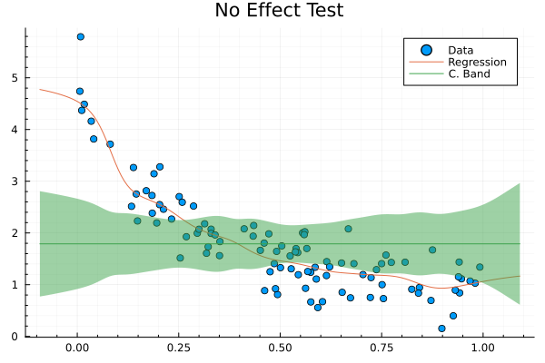
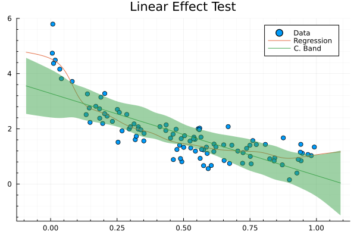

# Kernel Tests

## Description

This Julia module implements three statistical tests based on the kernel density estimator and in the kernel regression. It creates univariate, bivariate kernel density estimators, kernel simple regression and methods for plotting them using the `plot` function from `Plots` package.

---

## Tests

Currently there are only four tests but I'll add more later (open to volunteers):

### Distributions contrast test (`sameDistributionTest`)

**Null hypothesis**: Both sample 1 (`x`) and sample 2 (`y`) came from the same distribution.

**Test statistic:**

$$T_c = \int_D \left[f_x(u) - f_y(u)\right]^2 du$$

where $f_x(\cdot)$ and $f_y(\cdot)$ the KDE for each sample `x` and `y`, respectively.

**P-Value**: We aproximate the distribution of `T` statistic by resampling from (`x` $\cup$ `y`) `NIter` times and calculating the respective statistic each time.

### Independency test (`independencyTest`)

**Null hypothesys**: Sample 1 and sample 2 that came from two independent random variables.

**Test statistic**:

$$T_c = \frac{1}{n}\sum_{i=1}^n log\left(\frac{f_{xy}(x_i,y_i)}{f_x(x_i)f_y(y_i)}\right)$$

where $f_{xy}(\cdot,\cdot)$ is the joint bivariate kernel density estimation for `x`and `y`.

**P-Value**: We aproximate the distribution of `T` statistic by resorting sample `y` `NIter` times and calculating the respective statistic each time.

### Non Effect test (`noEffectTest`)

**Null hypothesys**: `x` has no effect on `y`.

**Test statistic:**

$$T_c = \frac{(SCE_0 - SCE_1)/(gl_0 - gl_1)}{SCE_1/gl_1}$$

where $SCE_0 = \sum_{i=1}^n(y_i - \bar{y})^2$, $gl_0=n-1$, $SCE_1 = \sum_{i=1}^n(y_i - \hat{m}(x_i))^2$ and $gl_1 = tr\left((\boldsymbol{I} - \boldsymbol{S})'(\boldsymbol{I} - \boldsymbol{S})\right)$. See (Bowman and Azzalini, 1997).

**P-Value**: We aproximate the distribution of `T` statistic by resorting sample `y` `NIter` times and calculating the respective statistic each time.

**Graphic alternative**: This test has a graphic version using confidence bands that is computationally faster when its performed over the `KernelRegression` object.

### linear effect test (`linearEffectTest`)

This test performs a simple linear regression and then applies the non effect test of `x` on the residuals of the linear regression.

**Graphic alternative**: This test has a graphic version using confidence bands that is computationally faster when its performed over the `KernelRegression` object.

## Future projects

I'd like to implement the following tests:

* Normality test.
* Graphical normality test using confidence bands.
* Symmetry test i.e. $f(x - \mu) = f(- x - \mu)$.
* Non-parametric ANCOVA.
* Graphical test for comparing two kernel regression.

## Tasks

* Update `example.ipynb`.
* Replace leave-one-out cross-validation by generalized cross-validation.
* Implement ANCOVA.
* Add confidence bands to univariate kernel density plot.

---

## Documentation

Currently there is not available documentation but I hope that the examples in `example.ipynb` and the test file can help you to understand how to load and use the module contained in `src` folder. Don't forget to change the working directory in the test file!

## References

* A. Bowman, A. Azzalini. (1997). *Applied Smoothing Techniques for Data Analysis: The Kernel Approach with S-Plus Illustrations*. Clarendon Press. 
