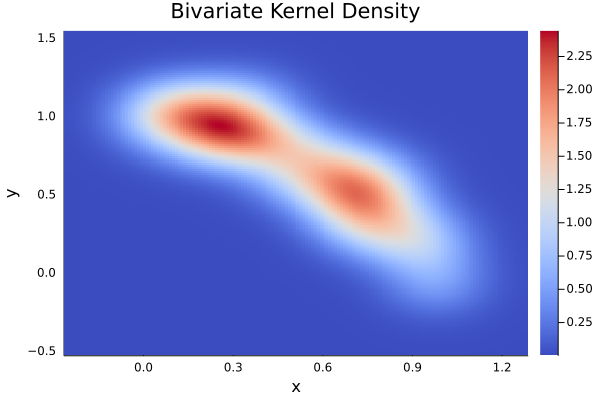

# Kernel Density Inference

## Description

This module implements three statistical tests based on the kernel density estimator. It creates univariate and bivariate kernel density estimators and methods for plotting them using the `plot` function from `Plots` package.

---

## Tests

Currently there are only two tests but I'll add more later (open to volunteers):

### Distributions contrast test

**Null hypothesis**: Both sample 1 (`x`) and sample 2 (`y`) came from the same distribution.

**Test statistic:**

$$T_c = \int_D \left[f_x(u) - f_y(u)\right]^2 du$$

where $f_x(\cdot)$ and $f_y(\cdot)$ the KDE for each sample `x` and `y`, respectively.

**P-Value**: We aproximate the distribution of `T` statistic by resampling from (`x` $\cup$ `y`) `NIter` times and calculating the respective statistic each time.

### Independency test

**Null hypothesys**: Sample 1 and sample 2 that came from two independent random variables.

**Test statistic**:

$$T_c = \frac{1}{n}\sum_{i=1}^n log\left(\frac{f_{xy}(x_i,y_i)}{f_x(x_i)f_y(y_i)}\right)$$

where $f_{xy}(\cdot,\cdot)$ is the joint bivariate kernel density estimation for `x`and `y`.

**P-Value**: We aproximate the distribution of `T` statistic by resorting sample `y` `NIter` times and calculating the respective statistic each time.

## Future projects

I'd like to implement the following tests:

* Visual normality test using confidence bands.
* Symmetry test i.e. $f(x - \mu) = f(- x - \mu)$.

---

## Documentation

Currently there is not available documentation but I hope that the examples in `example.ipynb` and the test file can help you to understand how to load and use the module contained in `src` folder. Don't forget to change the working directory!
